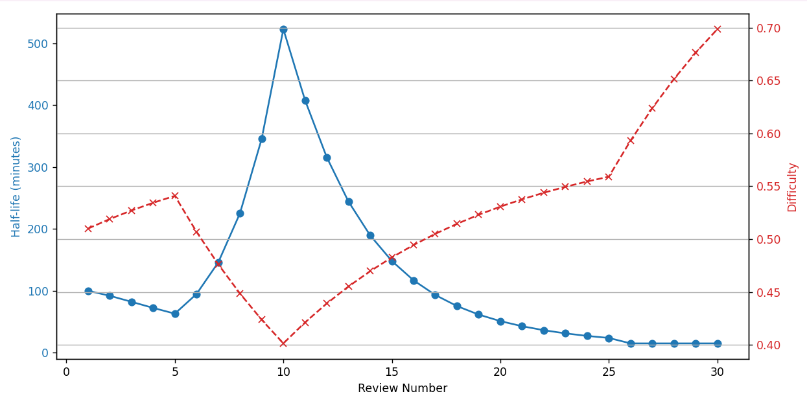

## 📖 About the Project

An **AI-powered Android app** that creates topic-based flashcards with questions of varying difficulty. Users receive instant answers, detailed explanations, and can interact with a chatbot for deeper learning—making self-study faster, smarter, and more engaging.

---

## ❗ Problems with Traditional Self-Study Tools

Despite the availability of learning apps and flashcard platforms, learners still face major challenges:

### 🕒 Time-Consuming Content Creation
Manually creating flashcards takes time and effort, making it hard to keep up with new topics.

### 🧩 Lack of Personalized Learning
Most apps do not adapt content or difficulty based on the user's current knowledge level or learning pace.

### ⏱️ No Real-Time Feedback
Learners often don’t know if their answers are correct or why they are wrong, slowing down the learning process.

### 🤐 Limited Interaction
Traditional flashcards are static—there’s no option to ask questions, clarify doubts, or explore a topic further.

### 😴 Low Engagement
Without dynamic content or interactivity, users often lose interest and fail to build consistent study habits.

### 📚 Not Scalable for Diverse Topics
Pre-built decks often don’t cover specific or niche topics, making it hard to study personalized content.

## ✨ Features Used

Our app combines multiple technologies and smart design choices to enhance the learning experience:

### 🤖 AI-Powered Flashcard Generation
Uses the Gemini API to generate flashcards based on any user-given topic with categorized difficulty levels (easy, medium, hard).

### 📢 Voice Answer Input
Allows users to speak their answers using Android’s speech-to-text, making learning more interactive and accessible.

### ✅ Instant Feedback & Evaluation
Analyzes spoken answers using Gemini, checks correctness, and provides constructive, real-time feedback.

### 💬 In-App AI Chatbot
Users can ask follow-up questions and explore deeper explanations through an integrated chatbot interface.

### 📊 Difficulty-Based Rating System
Users rate each flashcard (Again, Hard, Medium, Easy), which influences when the flashcard will appear again for review.

### 🧠 Personalized Learning Journey
Content and repetition timing adapt to each user’s learning pace and performance.

### 📱 Android-Native Interface
Smooth, responsive, and mobile-friendly UI for seamless user interaction on any Android device.

### 🔁 Spaced Repetition Logic
Implements a spaced repetition algorithm to optimize memory retention and long-term learning efficiency.

## 📈 Spaced Repetition Graph

The graph below demonstrates how the spaced repetition intervals evolve over time based on user ratings.

> **Inputs used:**  
> 5 × Medium  
> 5 × Easy  
> 15 × Medium  
> 5 × Hard

## 🛠️ Tech Stack

- **Frontend:** Android (Kotlin)
- **AI Integration:** Gemini API (Generative AI)
- **Voice Input:** Android Speech-to-Text
- **Backend:** Firebase (Authentication)
- **Design Tools:** Figma

## 🎯 Best Use Cases

- Students preparing for competitive exams
- Language learners expanding vocabulary
- Professionals revising technical concepts
- Self-learners exploring new subjects
